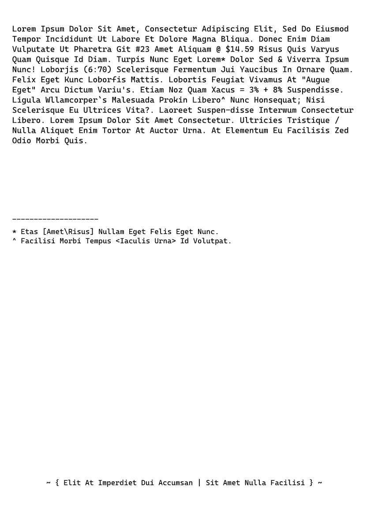
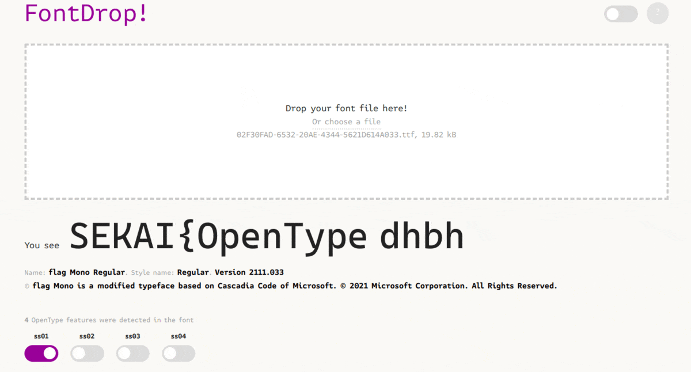

# Write up on Broken Converter and flag Mono

## Step 1: Problem Statement

This question is a double problem, with the same file giving us the flag for two different CTFs. The file is called Assignment-broken.xps.


The first question was Broken Converter with the following prompt:

```
Miku has finally finished her assignment and is ready to submit it – but for some reason, the school requires all assignments to be submitted as .xps files. 
Miku found a converter online and used the converted file for submission.
The file looked good at first, but it seems as if there’s something broken in the converter. Can you help her figure out what is wrong?
```

The second question was flag Mono, with this prompt:

```
When writing the assignment, Miku used a font called flag Mono.
Despite it looking just like a regular monospaced font,
it claims itself to be “stylistic” in various ways.

“Perhaps there’s something special about it”, Miku thought.
```

## Step 2: Initial Steps

First, we are given our Assignment-broken.xps

With some searching we can figure out that XPS stands for "Open XML Paper Specification," and it is similar to a .pdf file. If we want to open it on a Windows Computer, we can find a reader that Microsoft provides for us in Settings -> Apps -> Optional Features -> XPS Viewer.

After opening up the file, we can see it looks something like this:



With some searching, we can figure out that an XPS file is just a zip file (like how a .jar file is just a .zip file). So we can change the extension of the file and then extract it.

Once we extract it we get this file directory:

```
├── Documents
│   └── 1
│       ├── FixedDoc.fdoc
│       └── Pages
│           ├── 1.fpage
│           └── _rels
│               └── 1.fpage.rels
├── FixedDocSeq.fdseq
├── Resources
│   └── 02F30FAD-6532-20AE-4344-5621D614A033.odttf
├── [Content_Types].xml
├── _rels
└── docProps
    ├── core.xml
    └── thumbnail.jpeg
```

## Step 3: Making Sense of the Files

With some playing around, we might try and copy and paste the file contents into another file. By doing this, we can see that the contents copied to the clipboard are not the same content that we read when reading the file.

Instead of Lorem Ipsum Dolar ..., we get:

```
2sv3r *t,xr 4sBsv &9w )r3wG -sO,38w3wxv )M9t9,89O$ 'B9wG &3M 4s '9x,rsM ?3rtsv *O89M9MxOw gw 26nsv3 
'w 4sBsv3 06$O6 1B9ux6L 4sO38 'O9r 496r hxBtxw6w3 gw Do6v3wv6 A9w S[I )r3w )B9ux6r # T:/L7_ .9,x, fx9,
h6v|x, fx6r fx9,ux3 *M 496rL ?xvt9, >xO8 '$3w 2sv3rY 4sBsv &3M P h9y3vv6 *t,xr >xO8K 2snsvp9, W\%]NX
&83B3v9,ux3 <3vr3Owxr ex9 C6x89nx, *O =vO6v3 fx6rL <3B9{ '$3w (xO8 2snsv!9, 06ww9,L 2snsvw9, <3x$96w 
h9y6rx, )w R)x$x3 '$3wR )v8x 498wxr h6v9xV,L 'w96r >s} fx6r i68x, b IU @ ^U &x,t3OM9,,3L 29$xB6 HBB6r8svt3vm,
06B3,x6M6 Dvsq9O 29n3vsl >xO8 EsO,3ux6w` >9,9 &83B3v9,ux3 'x gBwv983, h9w6dL 26sv33w &x,t3O;M9,,3 *Ow3vzxr
-sO,38w3wxv 29n3vsL 2sv3r *t,xr 4sBsv &9w )r3w -sO,38w3wxvL gBwv9893, ?v9,w9ux3 Z >xBB6 )B9ux3w 'O9r ?svwsv 
)w )x8wsv gvO6L )w 'B3r3Owxr 'x <689B9,9, F3M =M9s 0svn9 fx9,L


55555555555555555555
Y 'w6, j)r3w".9,x,k >xBB6r '$3w <3B9, '$3w >xO8L  l <689B9,9 0svn9 ?3rtx, a*68xB9, gvO6c *M hsBxwt6wL


~ + 'B9w )w *rt3vM93w 4x9 )88xr,6O J &9w )r3w >xBB6 <689B9,9 Q ~

```

Hmm... Interesting. It seems like the font is messed up, and the symbols for each character do not correspond to what we think they should (ex. it seems 2 goes to L, s to o, etc).

Looking back at the File Tree Directory we saw from earlier, it seems like the Documents/ directory is the file dir for every single page on the document. _rels, FixedDocSeq.fdseq, \[Content_Types].xml seem to contain some property .xml files and then the docProps file gives us a thumbnail for the document.

The file which seems most interesting to investigate is the 02F30FAD-6532-20AE-4344-5621D614A033.odttf file, and with a quick google search, it seems that it is some type of font file. Only thing is that it seems that it is obfuscated, with the decryption key being somehow hidden inside the name of the file (`02F30FAD-6532-20AE-4344-5621D614A033`).

On Google, I was able to find a converter script to turn our obfuscated odtff font file into a more widely used tff file.

```python
#!/usr/bin/env python3

import os
import sys

fn_in = sys.argv[1]
fn_out = os.path.splitext(sys.argv[1])[0] + '.ttf'
print(fn_out)
# Parse
key = os.path.splitext(os.path.basename(fn_in))[0].replace('-', '')
# Convert to Int reversed
key_int = [int(key[i-2:i], 16) for i in range(32, 0, -2)]

with open(fn_in, 'rb') as fh_in, open(fn_out, 'wb') as fh_out:
    cont = fh_in.read()
    fh_out.write(bytes(b ^ key_int[i % len(key_int)] for i, b in enumerate(cont[:32])))
    fh_out.write(cont[32:])

# Credits to https://gist.github.com/dungsaga/ab8d2379bb566c9925b27df3bc82ca8b
```

Running this script with the command `python3 odtff_to_tff.py 02F30FAD-6532-20AE-4344-5621D614A033.odtff`, we get a .tff file. Bingo.

## Step 4: Playing With our Font File

To further investigate our `.tff` file, I found a good font viewer online called https://fontdrop.info/#/?darkmode=true

Dragging in our tff file, we can immediately find our first flag.


Bingo: Flag 1 is SEKAI{sCR4MBLed_a5ci1-FONT+GlYPHZ,W3|!.d0n&}
It seems for this flag, they just moved around the standard glyphs of ~!@#$%^&*()_+`1234567890-= ... into the flag.

For our second flag, we can again use our website fontdrop.info to help us.
If we try enabling different OpenType features (which in normal fonts are used when trying to type out different ligatures/font variants), we can see we get our next flag.


###### Credit to duksCTF for the image

<br>

What is happening is that the world: "flag" is turned into different parts of the flag when different OpenType features/ligatures are enabled.

So thats our second flag found, SEKAI{OpenTypeMagicGSUBIsTuringComplete}
